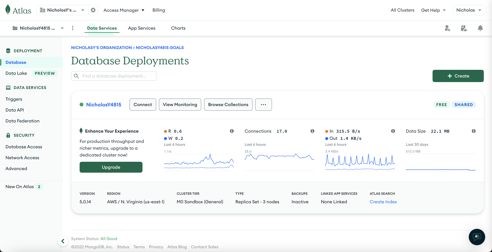
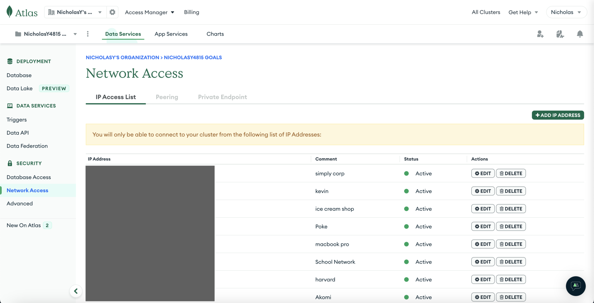

# Ant Lab Website
## by Nicholas Yang

Welcome to my website, dedicated to LS50 (Life Sciences 50: Integrated Science)! For my project, I decided to make a website that would collect all data that members of the class collected throughout the semester and put it in an easily accessible website that people could interact with. Before we jump in, I want to preface this by saying that there was a *lot* of reading that helped contribute to the completion of this project, and I hopefully don't forget any credits in the many open source projects that I utilized to make this website happen. Without further ado, let's get into the project!

# Table of Contents

1. [Setting Up](#1-setting-up)
   - NodeJS and NPM
   - MongoDB
   - OPTIONAL: Database Visualizer MongoDB Compass
2. [Running the Application](#2-running-the-application)
   - Repository
   - Next.js Build
   - PM2
3. [Acknowledgments](#3-acknowledgements)

## 1. Setting Up

Because there are quite a number of pre-requisites for this project to happen, I have decided to compartmentalize each of them into a collapsible tab that you can open up sequentially. They are as follows:

<details>
<summary>Node.js and NPM</summary>

One of the basic technologies that we will be using is Node.js and NPM. Node.js will be the primary programming language that we will be using in this project, and NPM is a package manager that can be installed alongside Node.js to help manage all of the open source packages that helped make this project happen.

To install, go to [this page](https://nodejs.org/en/) and download the LTS version (which is also known as the more stable version). After installing, open up the installer and it should guide you through the steps of installing the software. All of the default options should work fine for this project.

To make sure that this was installed correctly, you can run the following commands to double check:

```sh
$ node --version
v18.12.1
$ npm --version
8.19.2
```

If this is not what you see, you may have to restart your terminal to get the latest PATH variables.

[Back to 1. Setting Up](#1-setting-up)
</details>

<details>
<summary>MongoDB</summary>

For the database that I chose to use, I decided to use MongoDB as the overall syntax of MongoDB is more aligned with the JSON-like formatting commonly used in JavaScript projects, and they offer free hosting of their smallest MongoDB storage (we love free stuff!!). I also just wanted to dip my toes into NoSQL in general, and thought that there was no better time than to start now.

To get started, I would like to steer us to [MongoDB Atlas](https://www.mongodb.com/atlas/database) first, and get us signed up for a free account. Once you have that made, go ahead and create a free storage in the Shared plan, which is currently free. All of the default settings for the new cluster should be fine as is, and go ahead and create the new cluster. Your screen should look something like this: 



Once you have that completed, we will move onto configuring access. By default, MongoDB will restrict access to only permitted IPs. We will need to unlock some IPs so that we can access the database from our computers (and our servers, if we were to host the website).

To do this, navigate to the Network Access on the navigation menu on the left. You should see this screen (without all of the current IPs):



Click on **Add IP Address** on the right side of the screen, and click on *Add Current IP* Address on the popup. Then, give it an identifiable name and click on Confirm to complete!

Next, we will need to give ourselves database access. To ensure that only certain people are allowed to access the database, we will be making a unique username and password combination that our server will be logging in from (and one that we can use to log in from to visually see the data). To get started, go to the Database Access on the left navigation bar.

Following many of the same steps as adding an IP, we will create a new database user. Scrolling down a little bit, we will use a built-in role for the database user privileges. After you click on *Add Built In Role*, click on the dropdown menu and click on *Read and write to any database*. 

**Note:** for most production projects, you should always minimize the amount of privileges you grant to each user. This should include restricting how many database each user can access and edit, especially deletion privileges. However, for the sole purpose of simplicity, we will use one of the built-in roles provided for by MongoDB.

Scrolling all the way down, we will then see an *Add User* button. Clicking on that should add a new user to the database access list.

[Back to 1. Setting Up](#1-setting-up)
</details>

<details>
<summary>OPTIONAL: Database Visualizer MongoDB Compass</summary>

To set up a MongoDB-sponsored database viewer, MongoDB Compass, all we have to do is download the software from [this website](https://www.mongodb.com/try/download/compass). After downloading the software, your connection URI can be found on your MongoDB Atlas dashboard in the *Connect* buutton next to the cluster name. After clicking on the Connect button, click on *Connect using MongoDB Compass*, and a template string will be provided that you can copy and paste into the connection URI. All you have to do is replace the `<username>` and `<password>` with the username and password that you created in the previous section.

When you press *Connect*, assuming that all database and network access has been correctly set up, you should land in the database itself, where you will then be able to view all of the data that is in the project.

[Back to 1. Setting Up](#1-setting-up)
</details>

---

## 2. Running the Application

<details>
<summary>Repository</summary>

Finally, we get to the main codebase. To download the codebase off of Github, we will be using the `git clone` command. For simplicity, the full command is:

```sh
$ git clone https://github.com/Nickanda/cs50-final.git
```

Open up your terminal in the location where you downloaded the repository and run the following command to download all of the packages that the project needs to run:

```sh
$ npm install
```

You will also need to make a `.env` file that will contain your connection information for MongoDB. The `.env` file is one of the most secure places to store sensitive information, and is highly recommended over a traditional JSON or JS file to store this information.

The format of the file is:

```
MONGODB_URI=mongodb+srv://<username>:<password>@<cluster_url>/cs50
```

To dissect the three components that need to be replaced in the above section:

- **`<username>`**: The username of the database user that you previously created
- **`<password>`**: The password of the database user that you previously created
- **`<cluster_url>`**: Part of the Connection URI that you can find by pressing on the `Connect` button on your MongoDB Atlas dashboard, next to your cluster name. This should follow the format of `<cluster_name>.<random_string>.mongodb.net`. For example, my connection string could be `nicholasy4815.xyxyx.mongodb.net`.

The last portion of the connection URI opens up a new database with the name cs50 (which would store everything related to the cs50 project).

[Back to 2. Running the Application](#2-running-the-application)
</details>

<details>
<summary>Next.js Build</summary>

One of the softwares that I am using for this project is Next.js, which is a React.js framework that simplifies the process of routing *significantly* and is extremely easy to set up. However, as with all React projects, you will have to "build" the project (compile all of the scripts) and "start" the server (runs the server on a specific port).

If you want to run the development build, all you have to do is run the following command in your command line:

```sh
$ npm run dev
```

And your server should be live on [http://127.0.0.1:3000/](http://127.0.0.1:3000/).

If you want to run the production version, you will need to run the following commands:

```sh
$ npm run build

$ npm run start
```

The `npm run build` command may take some time as the computer compiles everything that it needs to run the server, and `npm run start` will start the server on [http://127.0.0.1:3000/](http://127.0.0.1:3000/).

[Back to 2. Running the Application](#2-running-the-application)
</details>

<details>
<summary>PM2</summary>

One of the most important aspects of a project is to make sure that it never falls down, even when it bumps into an error. However, for many modern projects, errors could happen at any point in run time, and they eventually become inevitable. We do, however, want to make sure that the effects are minimized when the program does bump into an error though, we want to make sure that the program starts up again instead of quitting and not running again.

For this, I decided to use PM2 (Process Manager 2). To install this process manager, run the following command:

```sh
$ npm install -g pm2
```

The `-g` flag will install the PM2 package globally so that it can be used in any project (and so that you can run pm2 in the command line in any project). To start the PM2 server, I have created an `ecosystem.config.js` file already that will automatically start the production build (**please refer to the last section to make sure that the production build is ready to be served**) of the front end and start the back end.

To start the PM2 process, first make sure PM2 has been correctly installed:

```sh
$ pm2 --version
5.1.0
```

And run the ecosystem file:

```sh
$ pm2 start ecosystem.config.js
```

Now, when the program wants to quit, PM2 will perform CPR on that program and make sure that it is resuscitated and alive again.

To view the live logs of both the back end and the front end, run the following command:

```sh
$ pm2 logs
```

You should see the following in your console:

```
0|frontend | ready - started server on 0.0.0.0:3000, url: http://localhost:3000
0|frontend | info  - Loaded env from /path/to/cs50-final/.env

1|backend  | Listening on port 3001
1|backend  | MongoDB has been connected!
```

[Back to 2. Running the Application](#2-running-the-application)
</details>

---

And that's it! That should allow you to run the program from scratch and get you started on the project.

---

## 3. Acknowledgements

Special thank you to the package maintainers and contributors of:

  - @emotion/cache
  - @emotion/react
  - @emotion/styled
  - @fontsource/roboto
  - @mui/icons-material
  - @mui/material
  - argon2
  - compression
  - cookie-parser
  - cors
  - dotenv
  - eslint
  - eslint-config-next
  - express
  - helmet
  - mongodb
  - mongoose
  - multer
  - next
  - react
  - react-dom
  - uuid

As this project would not have been possible without these packages.